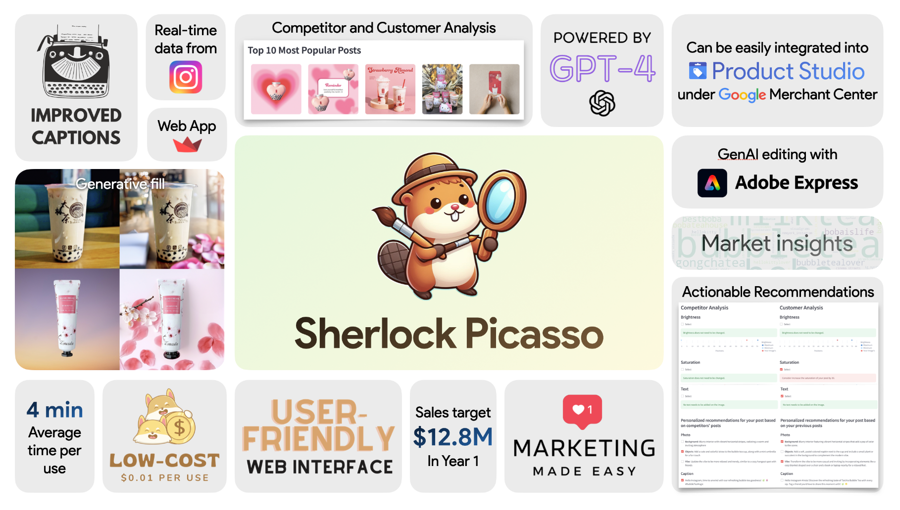
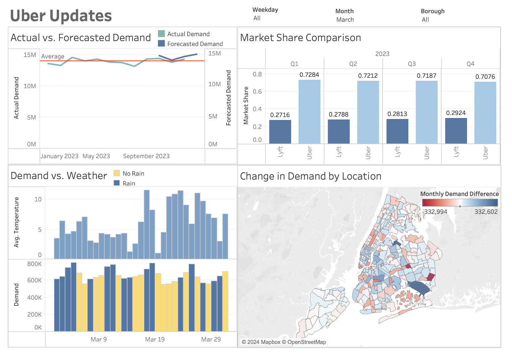

# About
Hello! I'm Raghav, a **Master of Business Analytics** candidate at **Massachusetts Institute of Technology (MIT)**, graduating in Aug 2024. I'm currently a Graduate Research Assistant under Prof. Swati Gupta, applying machine learning to improve kidney transplant donor matching. Previously, I earned a Bachelor's in Biomedical Engineering with Highest Honors from **Georgia Institute of Technology**. I've also conducted machine learning research on prostate cancer cells and completed internships at Abiomed (now acquired by Johnson & Johnson) and Flow MedTech (now Cardio REST). 

I excelled in **mental arithmetic** from age 4, mastering all 13 levels of SIP ABACUS and winning 1 international and 4 national competitions in India. I had the honor of meeting President of the India at the time, Pratibha Patil. Additionally, I was 1 of 2 students selected from my high school to speak at both a **TEDx event** and the **Middle East Youth Forum**, with my TEDx talk receiving over 26,000 views. Watch my TEDx talk [TEDx talk (What the abacus taught me)](https://www.youtube.com/watch?v=7EYWHe1yyjM)  

I love working with data and numbers and I'm passionate about leveraging data science and machine learning to enhance business decisions. 

Please feel free to reach out to me on: 
Email: rj30@mit.edu 
LinkedIn: [LinkedIn](https://www.linkedin.com/in/rrmj/) 
Github: [GitHub](https://github.com/raghavmanoharanjayanthi30) 

Happy to connect and have a discussion!

# Projects
Click on project titles for more details 

[MIT Analytics Lab: Building CMA CGM's First AI-Powered Email Assistant](alab.md)  
**⭐ Won 3rd place at the MIT Initiative on the Digital Economy’s Analytics Lab Event  **
  
CMA CGM is the largest shipping company in the US and receives 100,000+ emails a week. Responding to these emails consumes a lot of time for the customer service agents. This project develops an AI-powered email assistant to classify emails into different categories and generate responses to emails identified as automatable. Project uses **NLP**, **LLMs**.

[Sherlock Picasso: Marketing Tool for Small Medium Businesses](https://github.com/maxime7770/Sherlock-Picasso/blob/main/README.md) 
**⭐ Won 2nd place at the MIT Google Product Hackathon** 
  
80% of small and medium-sized businesses (SMBs) struggle with customer acquisition, especially with 74% of consumers buying online. While 47% handle marketing themselves, lacking expertise and resources hinders success. This tool aids SMBs by enhancing social media presence. Users submit an image, caption, and competitors' Instagram handles. Recommendations improve content based on customer preferences and competitor success. Project utilizes **NLP**, **LLMs**.

[Machine Learning Project: Multimodal Hate Speech Detection with Twitter Data (Images and Text)](https://github.com/raghavmanoharanjayanthi30/Multimodal-Hate-Speech-Detection/blob/main/ML_final_report.pdf)  
  
In today's social media landscape, platforms like X (formerly Twitter) serve as global hubs for expression. However, they grapple with the pervasive issue of hate speech, which targets individuals or groups based on identity factors. This poses significant threats to online safety and societal cohesion. This project aims to tackle this challenge by developing a machine learning model adept at discerning between hateful and non-hateful tweets. Through a **multimodal approach** utilizing both textual and image data, this model detects hate speech on Twitter using **Convolutional Neural Networks** and **BERT Transformer Models**.

[Analytics Edge Project: Predicting Startup Success](https://github.com/raghavmanoharanjayanthi30/Predicting-Startup-Success/blob/main/Analytics%20Edge%20Project%20Report.pdf) 
  
With startup trajectories being so complicated and volatile, this project aims to build a predictive model using data analytics and machine learning. By analyzing factors like market trends, funding dynamics, and team composition from historical data, this project seeks to assess startup success potential. The model aims to provide valuable insights for both high-profile and low-profile investors, entrepreneurs, and accelerators, aiding them in making informed investment decisions in the volatile startup landscape using **Random Forest**, **XG Boost**, **Sparse Logistic Regression**, and **CART** achieving 75% out of sample accuracy.

**Marketing Tool for Uber Manager with Tableau**  

The "Uber Updates" dashboard provides a visual summary of key performance metrics for Uber. It features comparisons of actual versus forecasted demand throughout 2023, quarterly market share against Lyft, and the impact of weather conditions on ride demand. Additionally, it includes a color-coded map showing changes in demand across different boroughs, highlighting geographical trends and variations. This dashboard serves as a tool for analyzing market dynamics and guiding strategic decisions.

[Financial News Sentiment Analysis](https://github.com/raghavmanoharanjayanthi30/Sentiment-Analysis-Financial-News)  
  
In the fast-paced world of finance, understanding market sentiment is vital for investors. However, analyzing sentiment from financial news can be time-consuming and subjective. Investors need a tool that can efficiently and objectively assess sentiment from financial news articles, providing actionable insights to make informed investment decisions. This is where this tool comes in, offering a solution to analyze sentiment from financial news to guide investment decisions. This sentiment analysis project uses techniques like **Sentence Transformer** for text embeddings, alongside models such as **Decision Trees**, **LSTM RNNs**, and **Random Forest**, enhanced through hyperparameter tuning and architectural experimentation achieving 76% out of sample accuracy.

[Movie Recommendation System using Content Based Filtering](https://github.com/raghavmanoharanjayanthi30/Movie-Recommendation-System/blob/main/README.md)  
[Demo](https://www.youtube.com/watch?v=kYPY2yMo_5E)  
  
As a passionate movie enthusiast, I often find myself facing the common dilemma of deciding what movie to watch next. Hours can pass as I consider countless options, unsure of which one will truly interest me. That's where favorite Movie Recommender System comes in! Simply select a movie from the list that you like, and let the magic unfold as it suggests 5 movies that are similar to the movie you selected. The recommender system uses content-based filtering and techniques such as **TF-IDF**, **Count Vectorizer**, and **BERT**.

[AI Earth Hackathon: Circular Economy Evaluation Tool](https://github.com/raghavmanoharanjayanthi30/AI-Earth-Hackathon/blob/main/README.md) 
**⭐ Ranked Top 15% in the AI Earth Hackathon **
  
In response to the proliferation of circular solutions, there's a pressing need to assess their efficacy. With numerous options available, determining the most effective ones is crucial for advancing sustainable practices. As circular economy initiatives gain momentum, the abundance of available solutions necessitates a reliable method to rank and prioritize them effectively. By evaluating metrics such as relevance to problem, impact, feasibility, and scalability, organizations can make informed decisions to drive meaningful environmental change. This tool leverages **NLP techniques**, **Zero Shot Classification**, and **Gemini Pro LLM** to evaluate circular economy solutions on the aforementionned metrics and more with each metric being scored between 1-3 and an average score being used to rank the solutions.

[Optimization Project: Stock Portfolio Optimization](https://github.com/raghavmanoharanjayanthi30/Stock-Portfolio-Optimization/blob/main/OPT%20Project%202023_Final%20Report_US%20Stock%20Portfolio%20Optimization%20(1).pdf) 
  
As novice investors, we were initially drawn to popular stocks, but quickly learned the complexities of the market. Pitfalls like emotional trading and market unpredictability became evident, prompting us to seek thoughtful investment strategies. Post-COVID-19, market volatility intensified, underscoring the need for careful navigation. This project addresses these challenges by optimizing portfolios using **mixed-integer**, **multi-objective optimization**, aiming to design optimal portfolios for traders facing diverse constraints and scenarios.

