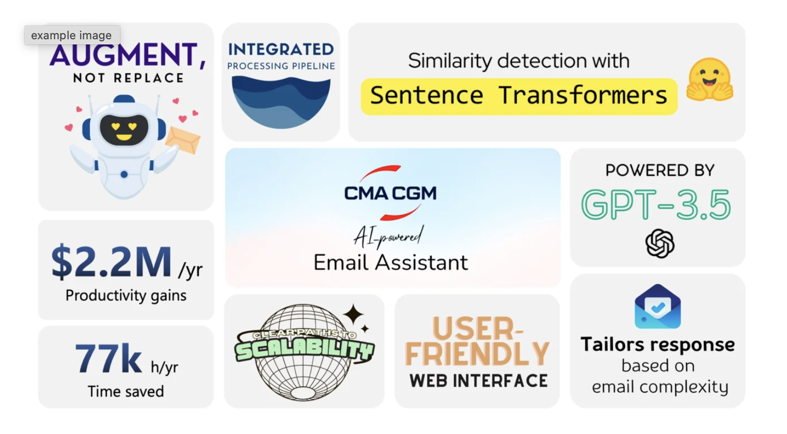

# About

Hello there! 👋 I’m Raghav, a Masters of Business Analytics candidate at MIT graduating in August 2024. I am currently working as a Graduate Research Assistant under the supervision of Professor Swati Gupta in collaboration with Massachusetts General Hospital, applying machine learning in kidney transplant allocation.

I graduated with Highest Honors with a degree in Biomedical Engineering from Georgia Institute of Technology in May 2023. I worked as a research assistant in 2021 under the supervision of Professor Ahmet Coskun applying machine learning in prostate cancer. I also did a couple of internships at Abiomed and Flow MedTech as a Product Development Co-op and Engineering Intern respectively.

I am an aspiring data scientist passionate about applying machine learning to improve business decisions.

Please feel free to reach out to me on: 
Email: rj30@mit.edu 
LinkedIn: [LinkedIn](https://www.linkedin.com/in/rrmj/) 
Github: [GitHub](https://github.com/raghavmanoharanjayanthi30) 

Happy to connect and have a discussion!

# Projects

[MIT Analytics Lab: Building CMA CGM's First AI-Powered Email Assistant](alab.md)  
⭐ Won 3rd place at the MIT Initiative on the Digital Economy’s Analytics Lab Event  
**Skills:** Python, Natural Language Processing (NLP), Large Language Models (LLM)

