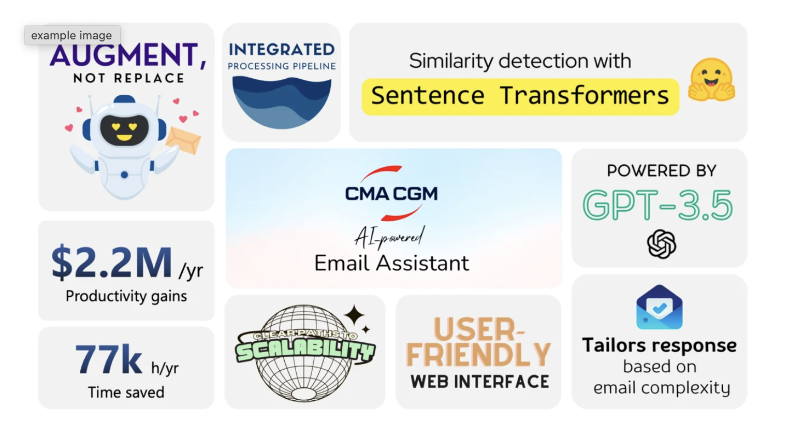

## **MIT Analytics Lab: Building CMA CGM's First AI-Powered Email Assistant**
#[Back to Main](README.md)  
 
⭐ This project won 3rd place at the MIT Initiative on the Digital Economy’s Analytics Lab Event.

**Background and Problem Statement**  
CMA CGM is the largest shipping company in the United States and handles more than 100k emails a week. However, they are currently processed manually by customer agents. There is a need for email classification and automating response generation to these emails.

**Proposed Solution**  
Built an AI email assistant that generates recommended replies to emails based on the task to be completed and further input from the customer agent. The assistant not only generates recommended replies to emails, but also provides an option for the customer agent to correct any categories the assistant might have miscategorized, enabling collection of feedback which can be used to further improve the responses.

**Summary**

**Actions**  

**Web Interface**
  

**Impact**  
Projected to reduce time spent on email replies by 38.1%, leading to time savings of over 77k hours/year and $2.2M in productivity improvements/year.

**Improvements for future**
- Establish a reliable method to measure the quality of the responses generated by the email assistant.  
- Consider using an ensemble similarity detection model to strengthen the reliability of the similarity detection, especially for emails that don't fall under one of the identified categories.  
- Devise a more efficient method to identify task categories, such as delivery or rolling requests, to address scalability challenges posed by manually identifying tasks and potential missed categories when new emails of different categories enter the system.   
